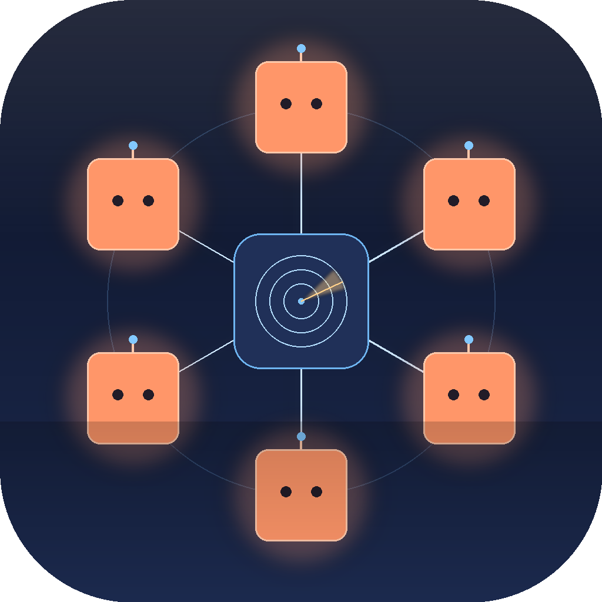

# Dispatch

A menu-bar app that turns every live Claude Code session into a unit on a
shared radio channel. Talk to them by voice, gate their tool calls with one
click, and see what's pending across all your terminals from a single icon.



## What it does

- **Discovers your live `claude` sessions** by reading
  `~/.claude/sessions/<pid>.json`. Every running terminal becomes a numbered
  unit (UNIT-1, UNIT-2, ...). Close a terminal → that unit drops off the
  roster within a second.
- **Centralises tool-call approvals.** Installs a PreToolUse hook so every
  `Bash` / `Write` / `Edit` / `WebFetch` from any of your sessions surfaces
  in the dispatch menu and dashboard. One-click Allow / Deny, or voice
  ("permission granted, over"). When 2+ are stacked up, you get a single
  `✅ ALLOW ALL (N)` row at the top of the menu.
- **Voice → typed into the right terminal.** Press `🎙 Talk to ALL`, say
  *"all units, status check, over"*, and the transcribed text is injected
  (typed + Enter) into every live session's iTerm/Terminal tab via
  AppleScript. Per-unit voice for directed messages too.
- **Mirrors Claude's own permission rules** so it doesn't over-prompt.
  Reads `~/.claude/settings(.local).json` and
  `<cwd>/.claude/settings(.local).json`; honours each session's
  `permissionMode` (acceptEdits / bypassPermissions / plan).
- **Web dashboard window** (native `WKWebView`, served by the in-process
  HTTP server on `127.0.0.1:8765`) for visual review — pending asks,
  channel log, per-unit cards with grant / deny / reply / elevate / mute.

## Install

Requires macOS 13+ on Apple Silicon (Intel may work; not tested),
Python 3.13, and these CLI tools on PATH:

```bash
brew install ffmpeg
pipx install openai-whisper       # transcription backend
# claude CLI: https://claude.com/code
```

Then build the .app:

```bash
git clone https://github.com/abhitsian/dispatch.git
cd dispatch
python3.13 -m venv .venv
.venv/bin/pip install -r requirements.txt
.venv/bin/python make_icon.py
.venv/bin/python -c "import sys; sys.setrecursionlimit(8000); import setuptools; sys.argv=['setup.py','py2app']; exec(open('setup.py').read())"
cp -R dist/Dispatch.app /Applications/
open /Applications/Dispatch.app
```

The first launch will prompt for **Microphone** and **Automation** permissions
(System Settings → Privacy & Security). Grant both — the mic for voice transmit,
Automation → Terminal/iTerm for typing into your terminals.

To enable cross-session tool-call gating, open the dispatch dashboard window
or menu and click **Settings → 🪝 Hook: not installed**. That writes a
`PreToolUse` entry to `~/.claude/settings.local.json` matching
`Bash|Write|Edit|WebFetch`. Start a new Claude Code session for it to take
effect; flip it off the same way any time.

## Use

Click the menu bar icon (or open `http://127.0.0.1:8765/ui` for the
dashboard window).

**Visual states at a glance:**

| Icon | Meaning |
|---|---|
| 🔘 | idle |
| 🔴 / 🟠 / 🟡 | recording — bigger dot = louder voice |
| 🟡 ↔ 🟤 ↔ 🟠 | transcribing |
| 🚨 ↔ 🟥 (pulsing) | something needs your input |
| 🟢 ↔ 💚 (pulsing) | a unit reported a task complete |
| 🔇 | channel audio muted |

**Voice protocol** (top-level transmit + radio-style):

| Say | Effect |
|---|---|
| `Dispatch to unit one, <message>, over.` | Inject `<message>` into UNIT-1's terminal |
| `Unit-3, <message>, over.` | Same, shorter |
| `All units, <message>, over.` | Broadcast |
| `Status check, over.` | Roll-call — every unit reports |
| `Permission granted, over.` (also: roger, copy, ten-four) | Grants the oldest pending ask |
| `Negative, over.` (also: denied, stand down) | Denies it |
| `Dispatch to unit one, elevate, over.` | Auto-allow all future tool calls from UNIT-1 (revoke with "revoke elevation") |

## How it works

```
        ┌────────────────────┐                   ┌─────────────────────┐
        │   Menu bar icon    │                   │   Dashboard window  │
        │ + macOS notifs     │                   │   (WKWebView)       │
        └────────┬───────────┘                   └──────────┬──────────┘
                 │                                          │
                 ▼                                          ▼
              ┌──────────────────────────────────────────────────┐
              │            Dispatch (Python)                     │
              │  state, router, session poller, hook approval    │
              └─────┬─────────────┬──────────────────────┬───────┘
                    │             │                      │
                    ▼             ▼                      ▼
            claude --resume   ~/.claude/         127.0.0.1:8765  ◀── curl ──┐
            (writes session    sessions/         (in-proc HTTP server)      │
             jsonl, returns    <pid>.json                                   │
             reply)            + projects/                                  │
                                 *.jsonl                              ┌─────┴──────┐
                                                                      │ Claude hook│
                                                                      │ pretool.sh │
                                                                      └────────────┘
                                                                            ▲
                                                                            │
                                                                Claude Code PreToolUse
```

| Layer | Job |
|---|---|
| `sessions.py` | Discovers live sessions via `~/.claude/sessions/<pid>.json`; reads jsonl for title, last assistant message, permission mode |
| `agents.py` | Stable callsign assignment, voice rotation, `claude --resume` bridge |
| `dispatch.py` | Channel state, FIFO radio queue, hook approval coordination, poller |
| `dispatch_server.py` | `127.0.0.1:8765` — `POST /approve` (hook), `GET /state` (dashboard), `POST /api/*` (actions) |
| `audio.py` | Mic record, ffmpeg pre-process, whisper (mlx if available) transcribe, `say`-based radio TTS, single playback queue |
| `terminal_inject.py` | AppleScript injection into iTerm/Terminal — finds the tab matching the session's tty |
| `allowlist.py` | Mirrors Claude's `permissions.allow` resolution so dispatch doesn't over-prompt |
| `hooks/pretooluse.sh` | Tiny curl wrapper. If dispatch is down, exits 0 → Claude shows its own prompt (fail-open) |
| `install_hook.py` | Adds/removes the `PreToolUse` entry in `~/.claude/settings.local.json` |
| `native_window.py` | NSWindow + WKWebView host for the dashboard |
| `app.py` | rumps menu bar, mic recorder, main-thread UI refresh, notifications |

## Privacy + safety

- All data stays on your Mac. The HTTP server binds **only** to `127.0.0.1`.
- Voice recordings live at `~/Library/Application Support/Dispatch/voice/` and
  the channel log at `~/Library/Logs/Dispatch/channel.log`. Both are local
  files you can delete any time.
- The hook fails open — if dispatch crashes, Claude Code falls back to its
  own permission prompt. You're never locked out.
- **Known limitation**: the localhost HTTP server is unauthenticated. Any
  process / browser tab on `localhost` can POST to `/api/*`. Single-user
  macOS this is fine; multi-user shared machines, harden it before you
  ship to others.

## License

MIT. See [LICENSE](LICENSE).
